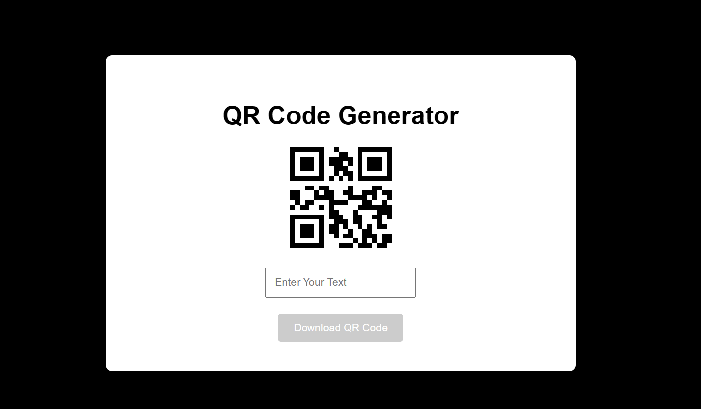

# QR Code Project

## Description

This project generates QR codes for various types of data. It is built using React and the `qrcode.react` library.

## Features

- Generate QR codes for URLs, text, and other data
- Save QR codes as image files

## Installation

1. Clone the repository:
   ```sh
   git clone https://github.com/CosZmo77/qrcode.git
   ```
2. Navigate to the project directory:
   ```sh
   cd qrcode
   ```
3. Install the required dependencies:
   ```sh
   npm install
   ```

## Usage

1. Start the development server:
   ```sh
   npm start
   ```
2. Open your browser and navigate to `http://localhost:3000` to use the QR code generator.

## Examples



Generate a QR code for a URL:

```sh
Enter the URL in the input field and click "Download QR Code".
```

Generate a QR code for a text:

```sh
Enter the text in the input field and click "Download QR Code".
```

## Contributing

Contributions are welcome! Please open an issue or submit a pull request.

## License

This project is Free to use for Anyone

## Contact

For any questions or suggestions, please contact [syedsaadahmed77@gmail.com](mailto:yourname@example.com).
